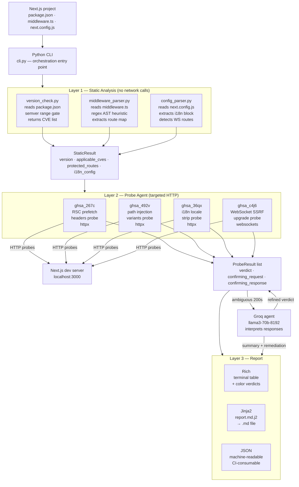

<div align="center">


# Perfetch - Next.js Middleware CVE Scanner


</div>
> Next.js middleware security scanner — detects CVE exposures that WAF cannot block.

Named after the segment-prefetch attack vector (`GHSA-267c-6grr-h53f`). Built in response to the [May 2026 Next.js coordinated security release](https://vercel.com/changelog/next-js-may-2026-security-release), which disclosed 13 advisories — four of which Cloudflare explicitly documented as impossible to mitigate at the WAF layer.

**If your WAF can't block it, something has to find it first.**

---

## 🧨 the problem

The May 2026 Next.js security release patched 13 advisories covering middleware bypass, SSRF, cache poisoning, and XSS. Cloudflare's WAF response documented four of these as having **no viable network-layer mitigation** — no WAF rule can safely block them without breaking application behavior. The only fix is patching, and the only way to know if you're exposed before patching is to test.

Generic scanners don't know what Next.js middleware looks like. They don't understand route matcher patterns, RSC prefetch headers, i18n locale stripping, or dynamic route parameter parsing. They spray generic payloads and miss the actual attack surface entirely.

perfetch reads your project's own middleware configuration and generates targeted probes from it — no generic payloads, no guessing.

---

## 🎯 what it detects

Four advisories with confirmed zero WAF coverage, sourced directly from the Cloudflare and Vercel advisories:

| Advisory | Description | WAF Coverage |
|---|---|---|
| `GHSA-267c-6grr-h53f` | RSC segment-prefetch requests bypass middleware auth | ❌ None |
| `GHSA-492v-c6pp-mqqv` | Dynamic route parameter injection bypasses middleware | ❌ None |
| `GHSA-36qx-fr4f-26g5` | i18n default-locale path stripping bypasses middleware | ⚠️ Custom rule only |
| `GHSA-c4j6-fc7j-m34r` | WebSocket upgrade requests trigger SSRF via Host header | ❌ None |

**Affected versions:** Next.js 13.x through 15.5.17, and 16.x through 16.2.5.  
**Patched versions:** 15.5.18 and 16.2.6.

---

## ⚙️ how it works

Three layers run sequentially. No layer starts until the previous one completes.

```
┌─────────────────────────────────────────────────────────┐
│  layer 1 — static analysis          (no network calls)  │
│                                                         │
│  reads package.json       → version gate                │
│  reads middleware.ts      → protected route map         │
│  reads next.config.js     → i18n + rewrite config       │
│                                                         │
│  output: which CVEs apply, which routes to target       │
└───────────────────────┬─────────────────────────────────┘
                        │
┌───────────────────────▼─────────────────────────────────┐
│  layer 2 — probe agent              (targeted HTTP)     │
│                                                         │
│  generates probes from your actual route config         │
│  fires CVE-specific bypass variants per protected route │
│  Groq interprets ambiguous responses (200 ≠ bypass)     │
│                                                         │
│  output: per-CVE verdict + confirming request           │
└───────────────────────┬─────────────────────────────────┘
                        │
┌───────────────────────▼─────────────────────────────────┐
│  layer 3 — report                                       │
│                                                         │
│  Rich terminal output with color-coded verdicts         │
│  Markdown report — full technical finding detail        │
│  JSON output — CI-consumable, machine-readable          │
│  Groq-generated executive summary + remediation         │
│                                                         │
│  output: perfetch-report.md + perfetch-report.json      │
└─────────────────────────────────────────────────────────┘
```

### 🔍 static analysis — reads your codebase, not a generic template

perfetch reads your actual `middleware.ts` matcher configuration and builds a map of protected routes before firing a single probe. If your middleware protects `/dashboard/:path*` and `/admin/:path*`, those are the exact paths that get tested — not a generic wordlist.

i18n configuration is read from `next.config.js`. If your app uses `defaultLocale: 'en'`, the i18n bypass probe strips the locale prefix and tests whether `/dashboard` is accessible without the `/en/` guard. If you have no i18n config, `GHSA-36qx` is skipped entirely — no false coverage.

WebSocket upgrade handling is detected from middleware patterns. If no WS routes are found, `GHSA-c4j6` is marked not applicable automatically.

### 🤖 probe agent — adaptive, not a payload list

Each CVE module knows its own attack mechanics:

**GHSA-267c** fires RSC prefetch header combinations — `RSC: 1`, `Next-Router-Prefetch: 1`, `Next-Router-State-Tree` variants — against every protected route. A `text/x-component` response with protected content on a prefetch request is a confirmed bypass.

**GHSA-36qx** strips the default locale prefix from each protected path and fires locale-stripped, double-locale, and encoded-locale variants. Tests the exact normalization gap the advisory describes.

**GHSA-492v** fires path injection variants — null bytes, encoded slashes, unicode normalization tricks — against dynamic route patterns extracted from the middleware matcher.

**GHSA-c4j6** sends WebSocket upgrade requests with manipulated `Host` and `X-Forwarded-Host` headers targeting cloud metadata endpoints and internal IP ranges. Detects SSRF surface at the protocol upgrade layer.

### 🧠 agent interpretation — LLM handles the ambiguous cases

HTTP response heuristics handle the clear cases: `401`/`403` is not a bypass, `302` to `/login` is not a bypass. The Groq agent (`llama3-70b-8192`) is called only when the verdict is uncertain — a `200` that might be a login form rendered at the protected URL, or an RSC payload that might be an empty unauthenticated shell.

The agent also generates the executive summary and per-CVE remediation guidance in the final report. Reasoning is observable — every agent call is logged with input, decision, and output so the scanner never produces a verdict you can't trace.

---

## 🏗️ architecture flow

How every piece of the stack connects — from your codebase on disk to the final report.



**Data flows in one direction** — static analysis feeds the probe agent, the probe agent feeds the report. The only feedback loop is the Groq agent refining ambiguous verdicts before they're written to `ProbeResult`. No layer has access to a layer above it.

**Trust boundary** — `StaticResult` is the contract between layer 1 and layer 2. The probe agent never reads the filesystem directly. The report layer never fires HTTP requests. Each layer is isolated to exactly its responsibility.

**Groq is optional infrastructure** — if `GROQ_API_KEY` is absent, the agent step is skipped and ambiguous verdicts fall back to `UNKNOWN`. Layers 1 and 3 are fully functional without it. The core detection logic (probe modules) runs entirely without LLM involvement.

---

## 📊 output

### terminal

```
╭─────────────────────────────────────────────────────╮
│ perfetch scan report                                │
│ target:  http://localhost:3000                      │
│ project: /home/user/projects/my-saas               │
│ next.js: 15.3.2 — AFFECTED                         │
│ scanned: 2026-05-25 14:32 UTC                       │
╰─────────────────────────────────────────────────────╯

findings
 advisory              severity  description                               verdict
 GHSA-267c-6grr-h53f  High      RSC segment-prefetch bypasses middleware  ✗ VULNERABLE
 GHSA-492v-c6pp-mqqv  High      Dynamic route parameter injection         ✓ PATCHED
 GHSA-36qx-fr4f-26g5  High      i18n default-locale path stripping        — N/A
 GHSA-c4j6-fc7j-m34r  High      WebSocket upgrade SSRF                   — N/A
```

### markdown report (excerpt)

```markdown
## GHSA-267c-6grr-h53f

| field    | value                                              |
|----------|----------------------------------------------------|
| severity | High                                               |
| verdict  | VULNERABLE                                         |
| waf      | investigating — no confirmed rule as of May 2026   |

**confirming request:**

GET http://localhost:3000/dashboard HTTP/1.1
RSC: 1
Next-Router-Prefetch: 1
Cookie: next-auth.session-token=eyJ...

**confirming response:**

HTTP/1.1 200
content-type: text/x-component

<dashboard RSC payload>

**remediation:** Upgrade to Next.js 15.5.18 or 16.2.6.
```

### JSON output

```json
{
  "summary": {
    "vulnerable": 1,
    "patched": 1,
    "not_applicable": 2
  },
  "findings": [
    {
      "advisory": "GHSA-267c-6grr-h53f",
      "verdict": "VULNERABLE",
      "confirming_request": "GET /dashboard HTTP/1.1\nRSC: 1\n...",
      "remediation": "Upgrade to Next.js 15.5.18 or 16.2.6."
    }
  ]
}
```

Exit code `1` on confirmed vulnerabilities — integrates directly as a fail-on-vuln CI gate without any dashboard or plugin required.

---

## 🔬 why this is different from a generic scanner

Most security scanners treat web applications as black boxes. They fire a fixed payload list, parse responses, and move on. perfetch works differently across every layer.

**It reads before it fires.** Before sending a single HTTP request, perfetch parses your codebase — `package.json`, `middleware.ts`, `next.config.js` — and builds a precise map of what's actually protected and how. Probes are generated from your route config, not from a generic wordlist. A project with no i18n gets zero i18n bypass probes. A project with no WebSocket handlers gets zero SSRF probes. Coverage is exact, not approximate.

**It understands Next.js internals.** The prefetch bypass (`GHSA-267c`) only works because Next.js's RSC prefetch code path is handled differently from a regular page request at the middleware layer. perfetch knows this. It fires the exact header combinations that trigger the vulnerable internal routing — `RSC: 1`, `Next-Router-Prefetch: 1`, `Next-Router-State-Tree` — not a generic header fuzzer. The same applies to every CVE module: each one encodes the actual attack mechanic, not a proxy for it.

**It interprets, not just observes.** A `200` response does not mean a bypass succeeded. A login page can render at the protected URL with a `200`. An RSC payload can be an empty unauthenticated shell. perfetch's heuristic layer handles the clear cases, and the Groq agent handles the ambiguous ones — asking "does the content of this response indicate protected data was returned?" before marking anything vulnerable. False positives cost trust. Every `VULNERABLE` verdict in perfetch has a confirming request and a confirming response attached to it.

**It was built the week these CVEs dropped.** The advisories were published May 7, 2026. This tool was built in response to reading both the Vercel release and the Cloudflare WAF coverage analysis — specifically the column that said "not possible" for four of the thirteen advisories. That gap is the entire reason this tool exists.

---

## 🧪 test coverage

Every probe module has a dedicated test suite using `respx` to mock HTTP responses — no live server required. Tests cover:

- Version gate: affected range detection, patched version early exit, semver prefix stripping, missing `package.json`
- Middleware parser: single and multi-pattern matchers, auth detection, WebSocket detection, `src/` directory fallback
- Config parser: i18n extraction, locale list parsing, `localeDetection: false`, missing config
- Probe modules: bypass confirmed, all variants blocked (patched), not applicable path per CVE
- Report: markdown content correctness, JSON structure and counts, terminal output smoke test

---

## 🚧 scope and known limitations

**in scope**

- Next.js 13.x, 14.x, 15.x, 16.x projects
- App Router and Pages Router
- Projects using `middleware.ts` or `middleware.js` for auth
- i18n-configured projects using `next.config.js`

**known limitations**

- Middleware parser uses regex heuristics — computed matcher arrays or dynamic spread syntax may not parse fully. Complex matchers are flagged in output with a note to review manually.
- WebSocket SSRF (`GHSA-c4j6`) blind confirmation requires a DNS callback server. The probe detects the attack surface and protocol-level signals; out-of-band confirmation is a documented gap.
- The Groq agent adds ~2–5 seconds per ambiguous response. If `GROQ_API_KEY` is not set, ambiguous verdicts fall back to `UNKNOWN` rather than crashing.
- Timing-based attacks and sub-millisecond race conditions are outside scope — those require dedicated instrumentation beyond HTTP-layer probing.

---

## 📎 references

- [Vercel — Next.js May 2026 Security Release](https://vercel.com/changelog/next-js-may-2026-security-release)
- [Cloudflare — React/Next.js Vulnerability WAF Response](https://developers.cloudflare.com/changelog/post/2026-05-06-react-nextjs-vulnerabilities/)
- [GHSA-267c-6grr-h53f](https://github.com/advisories/GHSA-267c-6grr-h53f)
- [GHSA-492v-c6pp-mqqv](https://github.com/advisories/GHSA-492v-c6pp-mqqv)
- [GHSA-36qx-fr4f-26g5](https://github.com/advisories/GHSA-36qx-fr4f-26g5)
- [GHSA-c4j6-fc7j-m34r](https://github.com/advisories/GHSA-c4j6-fc7j-m34r)
- [OWASP LLM Top 10](https://owasp.org/www-project-top-10-for-large-language-model-applications/)
- [MITRE ATLAS](https://atlas.mitre.org/)

---

<p align="center">
  <sub>built by a security engineer who also writes Next.js — because that overlap is exactly why this tool exists</sub>
</p>